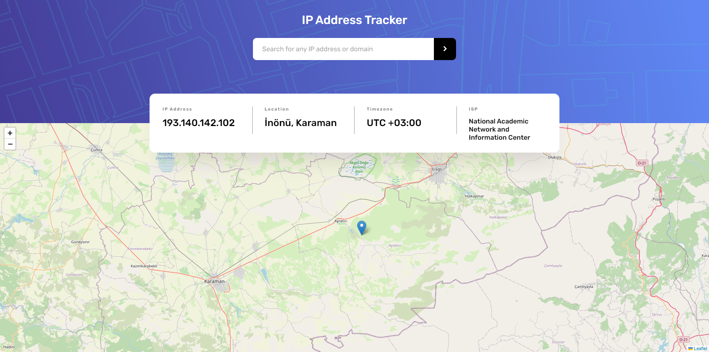

https://geo.ipify.org ' den veri cektim. daha onceki projelerimden biriydi. canli demo ornegine aşağıdan ulaşabilirsiniz. canlı demo olduğu için konsolo yazdırmadım.
doğrudan siteye giriş yaparak test edebilirsiniz. hava durumu uygulamasında da https desteklemediği için verileri çekerken sorun oluştu ve canlıya yükleyemedim. bu yüzden ip adresi tespiti uygulaması yapmak istedim
teşekkürler..

# IP Tracker

## Live Demo

You can try the app live by visiting [Live Demo](https://iptracker-focuscode.vercel.app).

## Features

- Search for IP addresses or domains to retrieve detailed information.
- View geographical location, including latitude and longitude coordinates.
- Explore additional data such as time zone, ISP (Internet Service Provider), and more.
- User-friendly interface for easy navigation and quick results.
- Ability to switch between different IP addresses or domains for querying.
- Responsive design for mobile and desktop use.
- Real-time tracking and updating of location and information.

